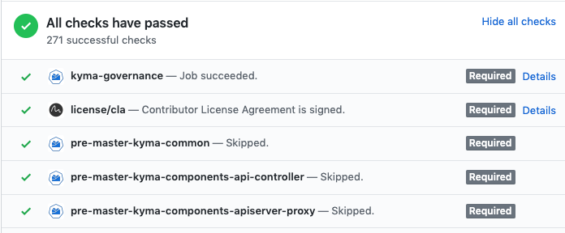

# Update component and its chart in one pull request

Created on 2019-04-23 by Adam Szecowka (@aszecowka) and Pawel Kosiec (@pkosiec). 

## Status
Proposed on 2019-04-23.

## Motivation
Currently, when you introduce changes to your component, you need to do at least two separate PRs:

- Changes made to the component
- Bump image version in the chart

Such an approach has many drawbacks:

- Slow development cycle, dealing with two PRs, asking for approvals twice
- A developer can forget to bump the image, in which case the version can be updated only on the release day. Updating version on the release day is 
the worst case scenario as it results in postponing the integration of our components. This is against the Continuous Integration approach.
- The code in the repository does not reflect the code that is actually used.
- Repository history is not transparent. Many commits only bump the component's image version.

## Goal
- You can introduce your changes and bump the image version of the Helm chart in the same pull request.
- Run Kyma integration tests with the modified component within the same pull request status checks.
- The `kyma` repository has a transparent commit history and commits that only bump image versions are rare.

## Proposed solution

The solution assumes using images built on pull requests on the master branch.

Let's assume that I am working on PR-1234. When I modify `componentA`, presubmit jobs build Docker images. 
The image has the same tag as the pull request number.
A developer can use this tag as a version in the `values.yaml` file:
```
component_a:
  dir: pr/
  version: PR-1234
```

With this approach, Prow executes component and integration jobs for the same PR. We have to ensure the proper order of jobs
to build components before using them in integration jobs. To achieve that, an additional step is required at the beginning of 
every integration job that waits for all dependent jobs. See [this](#guard-integration-jobs) section for more details.

In the beginning, the described approach can be optional, which means that a developer can decide whether he updates code and chart in the same PR or not. 
As a next step, we can introduce a job that checks if a version of the chart is updated in the PR. See
[this](#job-enforcing-changes-in-one-pr) section for more information.

In case there are two PRs that change the same component, there will be a merge conflict for the second PR because
it will modify the same line in the `values.yaml` file. Such approach ensures that the `master` branch contains changes from both PRs.

### Developers workflow
Let's assume that you work on an issue that requires changes in the `helm-broker` component. These are the steps you need to perform:
1. Create a branch.
2. Introduce changes to the `helm-broker`. Write or update unit tests.
3. Create a pull request to test the introduced changes (let's assume that the pull request has number `1234`). As only the `helm-broker` code was modified, 
the `pre-master-kyma-component-helm-broker` job is executed. All the other jobs are skipped.
If the job is successful, the component's image is published under `eu.grc.io/kyma-project/pr/helm-broker:PR-1234`.
4. Test your changes locally on Minikube. In order to use the newly created image, edit [this](https://github.com/kyma-project/kyma/blob/master/resources/helm-broker/values.yaml) `values.yaml` file:
    ```
    global:
    
      helm_broker:
        dir: pr/
        version: PR-1234
    ```
    If everything is fine, commit the changes you have made to the `values.yaml` file.
5. The following Prowjobs are triggered:
    - `pre-master-kyma-component-helm-broker` - even though component was not changed in this commit, Prow triggers all jobs
according to the changes introduced in the PR.
    - All pre-master integration jobs, such as `pre-master-kyma-integration`, `pre-master-kyma-gke-integration`, `pre-master-kyma-gke-upgrade`, etc. 
All these jobs are triggered because the file in the `resources` directory was modified. All integration jobs have a Guard step that waits
until `pre-master-kyma-component-helm-broker` is completed.
6. If all jobs are successful, you can merge changes to the `master` branch. The following jobs are triggered:
    - `post-master-kyma-component-helm-broker` which creates the `eu.grc.io/kyma-project/develop/helm-broker:{commit-id}` image. 
This image is not used.
    - All post-master integration jobs, such as `post-master-kyma-integration`, `post-master-kyma-gke-integration`, `post-master-kyma-gke-upgrade`, etc. 
These jobs do not have to wait for any other jobs because images that they use already exist.


### Guard integration jobs
To postpone the execution of integration jobs, we should add an additional step at the beginning of every integration job.
To decide whether the integration job can be executed, use the checks of a given pull request:


Most of these checks are sent by Prow and represent statuses of jobs execution.

The Guard workflow looks as follows:
1. Fetch all required checks sent by Prow for a given PR and commit SHA that represent components build. 
Guard filters checks by their names. In Kyma Prow configuration, there is a convention for
job names. For example, every component job name for master branch starts with `pre-master-kyma-components-`.
2. If any status is marked as failed, the integration job fails to reduce the number of provisioned clusters and VMs.
3. If all checks are successful, the integration job execution is continued.
4. If waiting for checks takes more than the defined timeout (10min), the integration job fails.
Notice that Prow defines a maximum number of concurrently executed jobs. 
There could be an extremely rare situation, that Prow executes only integration jobs that all wait for components jobs that cannot be executed because a maximum
number of concurrent jobs was reached. In such a case, a developer has to trigger an integration job manually. 
5. If some statuses are in the Pending state, wait some time (15s) and go to point 1.

Find more information on Guard implementation in [PR#904](https://github.com/kyma-project/test-infra/pull/904).

### Job enforcing changes in one PR
To require updating charts immediately, a new presubmit job should be defined. For example:
```
- Get components changed in the current PR (ignore Markdown files)
- Check if the chart uses the current version. Use the "path-to-referenced-charts" Makefile target.
```
Still, there should be an option to merge a PR without updating a chart. In such a case, a PR should have a special label, for
example the `postpone-integration`, in which case the presubmit job would succeed immediately.   
