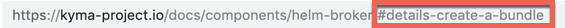

These are the guidelines for making cross-references between the documents in the [`kyma/docs`](https://github.com/kyma-project/kyma/tree/master/docs) folder.

>**NOTE:** The linking works only on the [Kyma website](https://kyma-project.io/docs). Currently, the cross-references between [GitHub documentation](https://github.com/kyma-project/kyma/tree/master/docs) is not available.

## Links between documents in the same topic

If you want to link to another document in the same topic, create a reference using the `#{type}-{title}-{header}` pattern, where:
- `{type}` is a metadata type of the document that you want to reference.
- `{title}` is a metadata title of the document that you want to reference.
- `{header}` is a header located in the document that you want to reference.

>**NOTE:** All variables must consist of lowercase characters separated with dashes (-).

If the `{type}` doesn't exist, the pattern has the form of `#{title}-{title}-{header}`. If you want to create a reference to the whole `{type}`, use the `#{type}-{type}` pattern.

>**TIP:** You can copy the reference to the documentation directly from the website. See the reference to the Helm Broker **Details** document:



### Links to the assets folder

To add a reference to a YAML, JSON, SVG, PNG, or JPG file located in the `assets` folder in the same topic, use GitHub relative links. For example, write `[Here](./assets/mf-namespaced.yaml) you can find a sample micro front-end entity.` When you click such a link on the `kyma-project.io` website, it opens the file content in the same tab.

## Links between documents in different topics

If you want to link to a document in a different topic, create a reference using the `/{type-of-topic}/{id}#{type}-{title}-{header}` pattern, where:
- `{type-of-topic}` is a type of topic that you want to reference. Apart from documents related directly to Kyma, all components have the `components` type of topic. For Kyma, use `root` in place of topic type.
- `{id}` is an ID of the topic that you want to reference. It is identical with the name of the component. For example, write `helm-broker` or `kyma`.
- `{type}` is a metadata type of the document that you want to reference.
- `{title}` is a metadata title of the document that you want to reference.
- `{header}` is a header located in the document that you want to reference.

>**NOTE:** All variables must consist of lowercase characters separated with dashes (-).

If the `{type}` doesn't exist, the pattern has the form of `/{type-of-topic}/{id}#{title}-{title}-{header}`. If you want to create a reference to the whole `{type}`, use the `/{type-of-topic}/{id}#{type}-{type}` pattern.

>**TIP:** You can copy the reference to the documentation directly from the website. See the cross-topic references to the Helm Broker **Details** document and to the Kyma **Overview**:


## Links in documentation toggles

To link to a document in a documentation toggle, the toggle must start with the `<div tabs name="{toggle-name}">` tag and end with the `</div>` tag, where **name** is a distinctive ID used for linking. To learn more about how to use toggles, read [this](#toggle-toggle) document.

If you want to link to a document in a documentation toggle, create a reference using `/{type-of-topic}/{id}#{type}-{title}-{header}` pattern as described in the previous sections, and add `--{toggle-name}--{tab-name}--{header}`, where:
- `{toggle-name}` is a value of the **name** attribute in the `<div>` HTML tag in the toggle that you want to reference.
- `{tab-name}` is a title of the tab containing the header that you want to reference.
- `{header}` is a header located in the document that you want to reference.

>**NOTE:** All variables must consist of lowercase characters separated with dashes (-). Change any character that is not a letter or number into a dash (-) and squash consecutive dashes (--) into one (-).

For example, the **Choose the release to install** heading changes into the `choose-the-release-to-install` header or the **Lorem ipsum dolor sit (amet)** heading becomes the `lorem-ipsum-dolor-sit-amet` header.

### Examples

- Absolute links

  This is an absolute link to a document in a documentatin toggle:
  ```markdown
  https://kyma-project.io/docs/root/kyma/#installation-install-kyma-on-a-cluster--provider-installation--gke--choose-the-release-to-install
  ```
  In the absolute link example:
  - `{toggle-name}` is `provider-installation`
  - `{tab-name}` is `gke`
  - `{header}` is `choose-the-release-to-install`


- Relative links

  To use a recommended relative link to a document in a documentation toggle which is in the same topic, use the following pattern:
  ```markdown
  #installation-install-kyma-on-a-cluster--provider-installation--gke--choose-the-release-to-install
  ```
