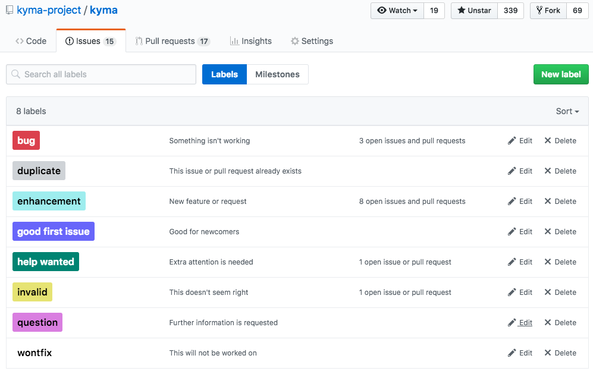

In the Kyma project, we use GitHub Issues for tracking development process, and [ZenHub](https://zenhub.com) to manage the issues on a team and sprint level and to have a clear overview of the work across all Kyma repositories.

This document explains:

- How the issues and pull requests workflows are organized in the Kyma project
- How issues triage is organized
- Which tools are used on every stage of the workflow

## Used labels

Our statement is to:
* Use default labels provided by GitHub
* Introduce new labels only if necessary

### Default labels

The default labels provided by GitHub are as follows:

### Custom labels

Here are the custom labels introduced by the Kyma team. The labels colors are provided in brackets in Hex code:

* `WIP` (#ECF44F) indicates that an issue is not ready for further processing.
* `decision` (#ED635E) indicates that an issue is related to a decision.
* `priority/critical` (#FB0104) indicates the top-priority of a given issue.
* `area/{CAPABILITY_NAME}` (#3CB913) indicates which capabilities are related to a given issue. You can assign more than one `area` label an issue.
* `area/quality` (#3CB913) indicates that an issue is related to a quality topic.
* `area/performance` (#3CB913) indicates that an issue is related to a performance topic.
* `security/{SEVERITY}` (#2D51F9) indicates a security issue based on its [CVSSv3](https://www.first.org/cvss/calculator/3.0) severity, either `low`, `medium`, `high`, or `critical`.
* `sig/{SIG_NAME}` (#E99694) indicates which [Special interest group (SIG)](/collaboration/#overview-overview) identified the issue and is responsible for further follow-up on the issue.
* `wg/{WG_NAME}` (#E99694) indicates which [Working group (WG)](/collaboration/#overview-overview) identified the issue and is responsible for further follow-up on the issue.

## Issues triage

Here is the flow diagram explaining how issues triage is performed:

There are eight different stages of the triage:

| Stage | Description | Labels |
|--------- |----------|---------|
| Validity | Assess the validity of the issue (whether it is taken for the further triage and proper classification). | invalid, duplicate, wontfix, question |
| Kind | Differentiate whether the related issue is a new feature or a bug. | enhancement, bug, test-failing |
| Decision | Check if the issue is related to a [decision](#kyma-working-model-kyma-working-model-decision-making). | decision |
| Help | Identify issues that do not have high priority and can be taken by the community. | help wanted, good first issue|
| Security | Specify the [CVSSv3](https://www.first.org/cvss/calculator/3.0) severity with the support of the security team. | security/{SEVERITY} |
| SIG/WG | Clarify which SIG or WG is involved in this issue and is responsible for the further follow-up on the issue. | sig/{SIG_NAME}, wg/{WG_NAME}|
| Priority | Prioritize issues in the general Kyma backlog to select those which are the most critical and should be taken as first. | priority/critical |
| Area | Clarify which capabilities or qualities are involved in a given issue. | area/{CAPABILITY_NAME}, area/quality or area/performance|

## Backlog

The Kyma backlog contains issues that went through the triage, are not closed, and have labels added (except for the issues with the `question` label). Backlog prioritization is realized by assigning issues to Kyma milestones (ZenHub Release) and assigning the `priority/critical` label. Critical issues assigned to the current milestone have the highest priority.

>**NOTE**: Issues are taken from the main Kyma backlog by different teams that are responsible for specific areas of Kyma. This is the actual workflow in Kyma which allows distinguishing which team works on a specific issue. This approach allows easy work in team sprints using ZenHub board. We are aware that our teams' names may be cryptic for the external community, but at the moment we are not able to provide any better solution. If you have a better idea, your feedback would be highly appreciated. Sorry for the inconvenience.

### Team sprints

Team Sprint is modeled as a GitHub milestone named with the following pattern: `Sprint_{TEAM_NAME}_{NUMBER}`. During the planning, a team selects issues from the backlog considering:
- priority (high priority first)
- area (default capability of the team first)
- dependencies (unblock others)

Contributors move the issue to the **In Progress** column on the ZenHub board when they start working on it. When the work is done, the issue is closed.

### Team backlog (optional)

If any team wants to keep team backlog (assign issues they want to work on later), they can assign it to the Github milestone with no due date named with following pattern: `Backlog_{TEAM_NAME}`.

### Stale issues

To keep the Kyma backlog clean, the bot monitors all repositories in the organization. It marks old, inactive issues with the `stale` (Hex: #E4E669) label and closes them after a given period of time. For configuration details, check the [sample file](https://github.com/kyma-project/kyma/blob/main/.github/stale.yml).

Although the bot helps us to keep the backlog clean, we regularly monitor its activities to make sure it is not closing issues that are still valid and important for Kyma. The Kyma team reviews the [ZenHub board](https://app.zenhub.com/workspaces/kyma---all-repositories-5b6d5985084045741e744dea/boards?labels=stale&showPRs=false) and acts on the issues as follows:
- Closed issues:
  - If the issue is still valid, reopen it and remove the `stale` label from it.
  -  If the issue is invalid, change the `stale` label to a more relevant one and add a comment that provides background and explains why the issue remains closed.
- Open issues:
  -  If the issue is valid, remove the `stale` label from it.

## ZenHub links

* Install the [ZenHub Chrome plugin](https://chrome.google.com/webstore/detail/zenhub-for-github/ogcgkffhplmphkaahpmffcafajaocjbd).
* Log into [ZenHub](https://www.zenhub.com/).
* Open the [Kyma ZenHub workspace](https://app.zenhub.com/workspace/o/kyma-project/kyma).
