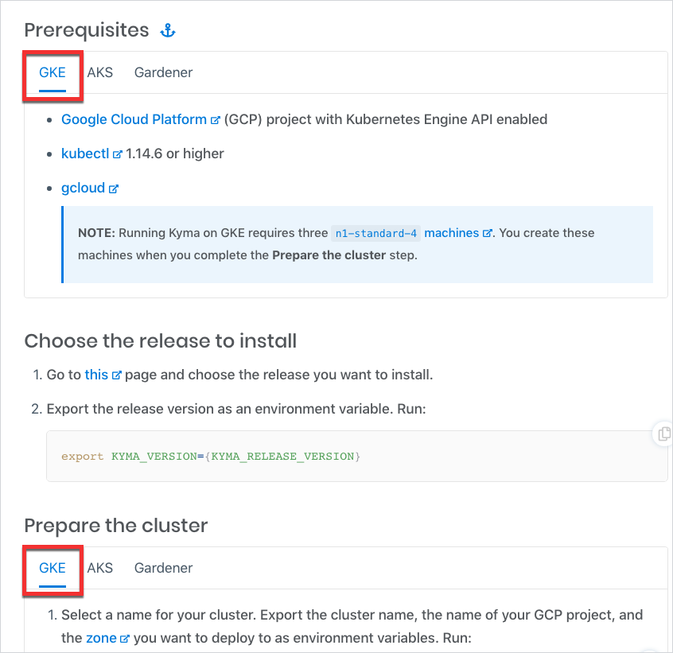

The documentation toggle is a feature that allows you to render several versions of a given section in one document or have several versions of one document.

The toggle renders the text in Github documents in the form of expandable sections and shows it as tabs on the `http://kyma-project.io` website.

You can use the toggle to include instructions for different operating systems (OS) in one guide or to describe installation guides that differ only in a few steps.  

## Writing rules

Follow these rules when inserting toggles in documents:

* Toggles belonging to one set must start with the `<div tabs name="{toggle-name}">` tag and end with the `</div>` tag, where **name** is a distinctive ID of a specific toggle used for linking. It can be any name describing the content of the documentation toggle.

See the example:

```markdown
<div tabs name="installation">
{toggle content}
</div>
```

* A single toggle must start with the `<details>` tag and end with the `</details>` tag.
* Insert the title of the toggle between `<summary>` and `</summary>` tags. Every part of the title must start from a new line.

See the example:

``` markdown
<summary>
From release
</summary>
```

* Leave a blank line after the `</summary>` tag. Only this way the content can render.
* Add content using Markdown syntax.
* Use this indentation when you add the toggle as a regular document section:

  - No spaces for the div element
  - Two spaces for other elements

* Use this indentation when you add a toggle under a list:

  - Four spaces for the div element
  - Six spaces for other elements

* When you add two or more toggle sets that belong to the same group, you must classify them properly. This way each time you switch to one of the toggles in the set, it opens automatically in all other sets from the same group within one document and across all documents that use the group. To create a toggle group:

  - All sets of toggles from the given group must contain the `group` attribute with a distinctive ID of this group. For example, add the `cluster-installation` group to categorize all toggle sets that refer to Kyma installation on a cluster.
  - Every `<summary>` tag in the set must also contain the `label` attribute. For example, add the `GKE` label to all toggles that describe steps for Kyma installation on a GKE cluster in the `cluster-installation` group.

  > **NOTE:** The label does not have to be the same as the summary. If the label is a combination of two or more words, separate them with the dash (`-`). For example, write `<summary label="install-on-gke">`.

  See the example:

  ``` markdown
  <div tabs name="prerequisites" group="cluster-installation">
    <details>
    <summary label="gke">
    GKE
    </summary>
    ...
    </details>
    <details>
    <summary label="aks">
    AKS
    </summary>
    ...
    </details>
    <details>
    <summary label="gardener">
    Gardener
    </summary>
    ...
    </details>
  </div>
  ```

## Examples

This section contains exemplary uses of the toggle in Markdown documents.

* See the example of the toggle added as a regular document section:

```markdown
<div tabs name="default-settings" group="configuration">
  <details>
  <summary label="local-installation">
  Local installation
  </summary>

  For the list of all components available to install see the `installer-cr.yaml.tpl` file.
  For the list of the default installation overrides see the `installer-config-local.yaml.tpl` file.
  Other configuration values are defined directly in the configuration of the respective components.

  >**CAUTION:** The default configuration uses tested and recommended settings. Change them at your own risk.
  </details>
  <details>
  <summary label="cluster-installation">
  Cluster installation
  </summary>

  The default installation flow uses a Kyma release.
  All components available in a given release are listed in the  `kyma-installer-cluster.yaml`, which is one of the release artifacts.
  Any required overrides are described in the [cluster installation guide](#installation-install-kyma-on-a-cluster).
  Other settings are defined directly in the configuration of the components released with the given Kyma version.
  </details>
</div>
```

The code renders on `kyma-project.io` as follows:


* See the example of the toggle added under a list:

```markdown
1. First element
2. Second element

    <div tabs name="installation">
      <details>
      <summary>
      From release
      </summary>

      When you install Kyma locally from a release, follow the [guide](https://kyma-project.io/docs/root/kyma/#installation-install-kyma-locally).
      Ensure that you created the local Kubernetes cluster with `10240Mb` memory and `30Gb` disk size.

      ```bash
      ./scripts/minikube.sh --domain "kyma.local" --vm-driver "hyperkit" --memory 10240Mb --disk-size 30g
      ```

      Run the following command before triggering the Kyma installation process:

      ```bash
      kubectl -n kyma-installer patch configmap installation-config-overrides -p '{"data": {"global.knative": "true", "global.kymaEventBus": "false", "global.natsStreaming.clusterID": "knative-nats-streaming"}}'
      ```

      </details>
      <details>
      <summary>
      From sources
      </summary>

      When you install Kyma locally from sources, add the `--knative` argument to the `run.sh` script. Run this command:

      ```bash
      ./run.sh --knative
      ```
      </details>
    </div>
```

The code renders on `kyma-project.io` as follows:


* See the example of two toggle sets which belong to a group of toggles:

```markdown
<div tabs name="prerequisites" group="cluster-installation">
  <details>
  <summary label="gke">
  GKE
  </summary>

  ...
  </details>
  <details>
  <summary label="aks">
  AKS
  </summary>

  ...
  </details>
  <details>
  <summary label="gardener">
  Gardener
  </summary>

  ...
  </details>
</div>

...

<div tabs name="prepare-the-cluster" group="cluster-installation">
  <details>
  <summary label="gke">
  GKE
  </summary>

  ...
  </details>
  <details>
  <summary label="aks">
  AKS
  </summary>

  ...
  </details>
  <details>
  <summary label="gardener">
  Gardener
  </summary>

  ...
  </details>
</div>
```

The code renders on `kyma-project.io` as follows:


