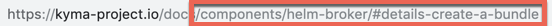
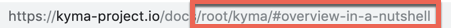

Linking is a great tool to use to incorporate a lot of content into your document with fewer words. That being said, overuse of linking can cause "link rot" when links break, and if a page has more links than content, it is not very pleasant to read. Make sure to use links correctly by adhering to these best practices:

- Use absolute links to link to other repositories and external sources.
- Use relative links to link to documents or files located in the same repository.
- Every link has the potential to go bad over time and the more links you include, the higher the chance that one will break. If something is not central to the subject at hand, is well-known by your audience, or can be found with a simple search, there is no point in linking.
- Choose the link text carefully. Do not link entire phrases which become overemphatic. Instead, choose the noun, such as an article or specification within the phrase that helps the reader understand where the navigation leads them. Use descriptive text for the search engines to understand your content. Avoid certain [vague words](https://web.dev/link-text/#how-the-lighthouse-link-text-audit-fails) like `this`, `that`, or `here`.

    Example:  
     ⛔️ "For more information, see **this** guide." or "Read more **here**."   
     ✅ "For more information, see the **installation guide**."  

To create cross-reference links between documents in the `kyma/docs` folder, follow the guidelines below.

>**NOTE:** Cross-reference linking works only on the [Kyma website](https://kyma-project.io/docs). Currently, linking between [GitHub documents](https://github.com/kyma-project/kyma/tree/main/docs) is not available.

## Links between documents in the same topic

If you want to link to another document in the same topic, create a reference using the `#{type}-{title}-{header}` pattern, where:

- `{type}` is a metadata type of the document that you want to reference.
- `{title}` is a metadata title of the document that you want to reference.
- `{header}` is a header located in the document that you want to reference.

> **NOTE:** All variables must consist of lowercase characters separated with dashes (-).

If the `{type}` doesn't exist, the pattern has the form of `#{title}-{title}-{header}`. If you want to create a reference to the whole `{type}`, use the `#{type}-{type}` pattern.

> **TIP:** You can copy the reference to the documentation directly from the website. See the reference to the Helm Broker **Details** document:


### Links to the assets folder

To add a reference to a YAML, JSON, SVG, PNG, or JPG file located in the `assets` folder in the same topic, use GitHub relative links. For example, write `[Here](./assets/mf-namespaced.yaml) you can find a sample micro frontend entity.` When you click such a link on the `kyma-project.io` website, it opens the file content in the same tab.

## Links between documents in different topics

If you want to link to a document in a different topic, create a reference using the `/{type-of-topic}/{id}#{type}-{title}-{header}` pattern, where:

- `{type-of-topic}` is a type of topic that you want to reference. Apart from documents related directly to Kyma, all components have the `components` type of topic. For Kyma, use `root` in place of topic type.
- `{id}` is an ID of the topic that you want to reference. It is identical with the name of the component. For example, write `helm-broker` or `kyma`.
- `{type}` is a metadata type of the document that you want to reference.
- `{title}` is a metadata title of the document that you want to reference.
- `{header}` is a header located in the document that you want to reference.

> **NOTE:** All variables must consist of lowercase characters separated with dashes (-).

If the `{type}` doesn't exist, the pattern has the form of `/{type-of-topic}/{id}#{title}-{title}-{header}`. If you want to create a reference to the whole `{type}`, use the `/{type-of-topic}/{id}#{type}-{type}` pattern.

> **TIP:** You can copy the reference to the documentation directly from the website. See the cross-topic references to the Helm Broker **Details** document and to the Kyma **Overview**:





## Links in documentation toggles

To link to a document in a documentation toggle, the toggle must start with the `<div tabs name="{toggle-name}">` tag and end with the `</div>` tag, where **name** is a distinctive ID used for linking. For more information, read a separate [document on toggles](#toggle-toggle).

If you want to link to a document in a documentation toggle, create a reference using `/{type-of-topic}/{id}#{type}-{title}-{header}` pattern as described in the previous sections, and add `--{toggle-name}--{tab-name}--{header}`, where:

- `{toggle-name}` is a value of the **name** attribute in the `<div>` HTML tag in the toggle that you want to reference.
- `{tab-name}` is a title of the tab containing the header that you want to reference.
- `{header}` is a header located in the document that you want to reference.

> **NOTE:** All variables must consist of lowercase characters separated with dashes (-). Change any character that is not a letter or number into a dash (-) and squash consecutive dashes (--) into one (-).

For example, the **Choose the release to install** heading changes into the `choose-the-release-to-install` header or the **Lorem ipsum dolor sit (amet)** heading becomes the `lorem-ipsum-dolor-sit-amet` header.

### Examples

- Absolute links

  This is an absolute link to a document in a documentation toggle:

  ``` markdown
  https://kyma-project.io/docs/root/kyma/#installation-install-kyma-on-a-cluster--provider-installation--gke--choose-the-release-to-install
  ```

  In the absolute link example:

  - `{toggle-name}` is `provider-installation`
  - `{tab-name}` is `gke`
  - `{header}` is `choose-the-release-to-install`

- Relative links

  To use a recommended relative link to a document in a documentation toggle which is in the same topic, use the following pattern:

  ``` markdown
  #installation-install-kyma-on-a-cluster--provider-installation--gke--choose-the-release-to-install
  ```

## Links to specifications

Follow these rules:

- To link to a specification in the same or a different topic, create a reference using the `/{type-of-topic}/{id}/specifications/{name-of-specification}` pattern, such as `/components/application-connector/specifications/connectorapi/`. `{type-of-topic}` and `{id}` are described in the previous sections, and `{name-of-specification}` is the name of the specification defined in the ClusterAssetGroup CR.

  > **NOTE:** For more information on adding specifications as a ClusterAssetGroup CR, read the [instructions](#add-new-documentation-to-the-website).

- If the specification used in the ClusterAssetGroup CR of a specific topic is in the `assets` folder of this topic, the reference should have the pattern of `./assets/{name-of-specification}.{extension}`, where `extension` is the extension of the file. For example, write `./assets/connectorapi.yaml` and the link will be properly modified on the website to `/components/application-connector/specifications/connectorapi/` during the website rebuild process.
