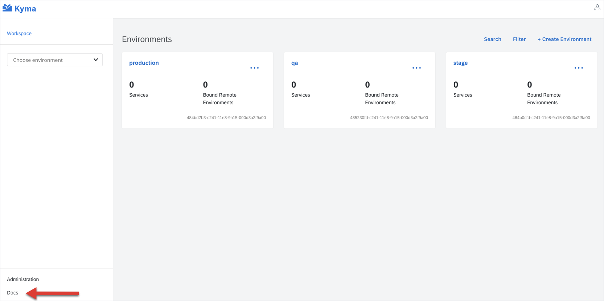

As someone once said, a picture is worth a thousand words. Therefore, whenever you need to illustrate operations performed on the UI, use a screenshot to convey the information visually.

Follow these basic principles when you place screenshots in your content:

- Do not overuse screenshots and limit visual noise.
- Do not use directional indicators such as "above" and "below" to refer to screenshots. Instead, include a brief introduction before each screenshot that describes its purpose and any necessary details.
- Do not include the mouse pointer in your screenshots, unless it shows a function related to the content.
- Do not include unnecessary elements, such as the browser toolbar. Include only elements that are relevant for the given content.

For details on how to format screenshots and their elements in Kyma documents, see the particular document sections.

## Alternative text

Always add an alternative (alt) text that concisely describes the content or function of the image you are referring to. The alt text:

- Helps to maintain accessibility for every visitor, including people with vision impairments.
- Appears in place of an image if it fails to load.
- Improves the SEO of the website by enabling crawlers to index the image contents better.

    ⛔️ ``  
    ✅ ``  

## Tool

Adjust or capture your screenshots using any tool that outputs high quality images, such as [Snagit](https://www.techsmith.com/screen-capture.html), [Lightshot](https://app.prntscr.com), or [Monosnap](https://www.monosnap.com/welcome). The desired image format is SVG, but PNG and JPG formats are also acceptable.
Use an online tool such as [TinyPNG](https://tinypng.com/) to compress images and limit the size of each image to 1MB, or smaller.
If you want to control the size of the image relative to the screen size, use one of these standard percentages: 100%, 75%, 50%, or 25%.

>**NOTE:** The images keep their original aspect ratio on both the Console UI and the `kyma-project.io` website. However, the maximum width on the website is 860px. Any image that exceeds that limit is resized to the maximum width.

Name the file as `{screenshot-name}` and save it under the corresponding `assets` directory.

## Borders

Use **grey** (HEX: #D2D5D9) 1pt border for the screenshot.

## Steps

If necessary, mark multiple areas or steps on the screenshot using **blue** (HEX: #0A6ED1) round stamps with white numbers.
Explain the steps under the screenshot with the ordered list.

## Indicators

To highlight a certain area of your screenshot, use **red** (HEX: #EF2727) 10pt for arrows or boxes.

> **NOTE:** Use arrows and boxes sparingly, only to point to an exceptionally important area of the screenshot. Do not use more than one indicator in one screenshot to avoid visual noise.

## Examples

See the exemplary screenshots for reference:

* Example 1

* Example 2

