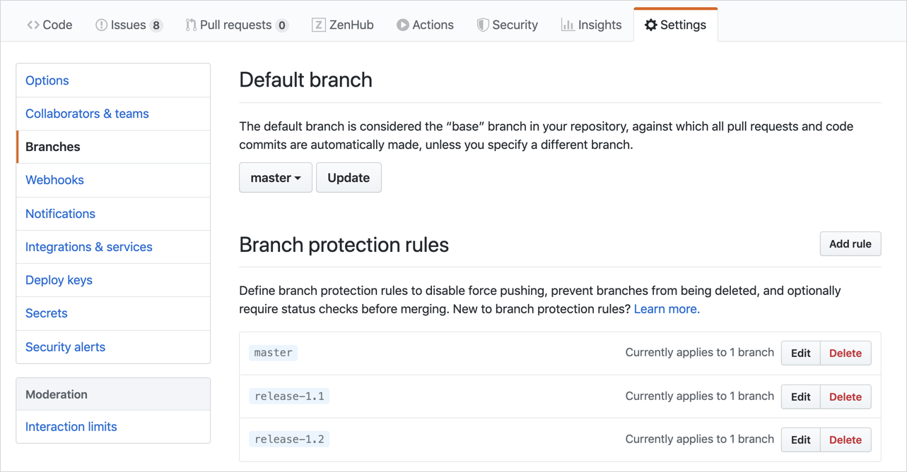
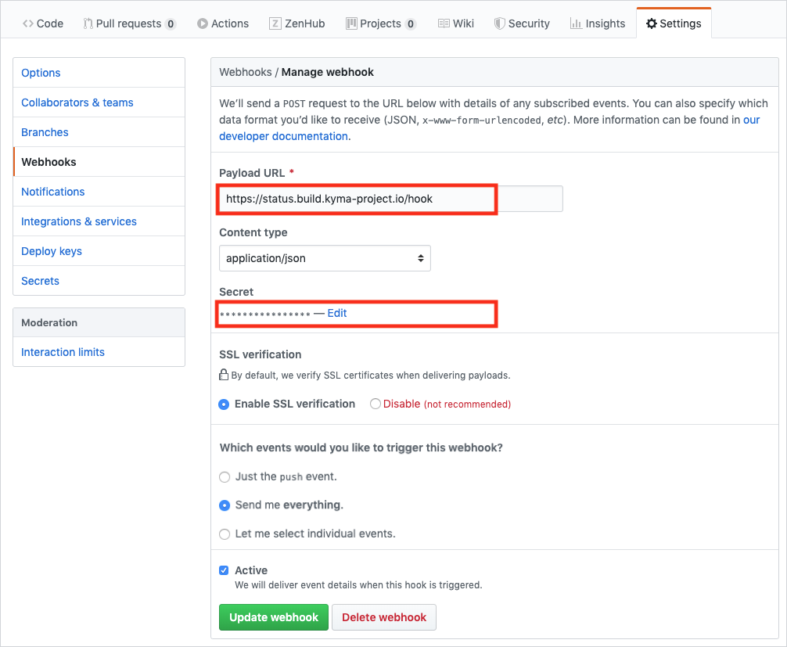
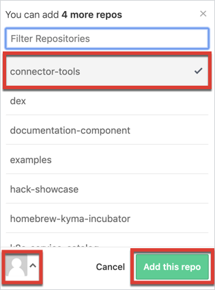

All repositories in `kyma-project` and `kyma-incubator` organizations should be similar in structure, settings, and restrictions. Follow these guidelines to adjust settings of a new repository created in one of these organizations.

> **NOTE:** You have to be an owner of the given organization to create a new repository in it.

## Use the repository template

After you create a new repository, copy the basic repository structure from the [`template`](https://github.com/kyma-project/community/tree/main/guidelines/repository-guidelines/repository-template) folder that is available in the `community` repository. It contains such files as the obligatory Apache license, the `CODEOWNERS` file that governs the review and approval flow in the repository, and the Stale Bot that handles inactive issues.

After copying the folder's contents, modify these according to the instructions they contain:
- [`CODEOWNERS`](https://github.com/kyma-project/community/tree/main/guidelines/repository-guidelines/repository-template/CODEOWNERS) to define who is responsible for the review and approval of specific repository parts
- [`README.md`](https://github.com/kyma-project/community/tree/main/guidelines/repository-guidelines/repository-template/README.md) to describe the repository and explain how to use and develop it

## Adjust repository options

Under the repository name, choose the **Settings** tab. The **Options** view opens as the default one in the left menu.

1. Scroll down to the **Features** section and clear these options:
- Wikis
- Restrict editing to users in teams with push access only
- Projects


2. Go to the **Merge button** section and clear these options:
- Allow merge commits
- Allow rebase merging


Leave only the **Allow squash merging** option selected. This option combines all commits into one before merging the changes into the `main` branch.

## Set branch protection rules

Define branch protection rules that include enforcing obligatory review and approval of pull requests (PRs), and define which Prow jobs need to pass successfully before merging PR changes into the `main` branch.

To see these settings, go to **Branches** in the left menu, under repository **Settings**:



In Kyma, the protection rules are defined in the Prow [`config.yaml`](https://github.com/kyma-project/test-infra/blob/main/prow/config.yaml) file generated from rules defined in the [`prow-config.yaml`](https://github.com/kyma-project/test-infra/blob/main/templates/templates/prow-config.yaml) file and handled by a Prow component called [Branch Protector](https://github.com/kyma-project/test-infra/blob/main/docs/prow/prow-architecture.md#branch-protector).

If you add a new repository in:
- `kyma-project`, you do not need to add a new entry to the Prow `config.yaml` file as the branch protection is already defined for [all repositories](https://github.com/kyma-project/test-infra/blob/main/prow/config.yaml#L380) within this organization. The only exception is if you want to specify additional rules that are not handled by Prow.
- `kyma-incubator`, add a new repository entry to the Prow `config.yaml` file, under **branch-protection.orgs.kyma-incubator.repos**. [See](https://github.com/kyma-project/test-infra/blob/main/templates/templates/prow-config.yaml) an example of such an entry for the `marketplaces` repository.

## Add webhooks

Add ZenHub and Prow webhooks to integrate them with your repository. This way, GitHub can send all events from the repository to Prow and notify ZenHub on the selected events related to issues and pull requests.

These settings are available under **Webhooks** in the left menu, under repository **Settings**:


### Prow webhook

Only Prow admins can activate the Prow webhook. To activate the Prow webhook in your repository, a Prow admin must have admin permissions. Contact Prow admins by creating an issue in the `test-infra` repository with the details of your request. You can also contact them on the [CI Slack channel](https://kyma-community.slack.com/messages/CD1C8PK1B/).

To activate the Prow webook:
1. A Prow admin connects to the Prow cluster and retrieves `hmac-token` from a Secret. They run:
```
kubectl get secret hmac-token -o jsonpath="{.data.hmac}" | base64 --decode
```
2. The Prow admin enters the `hmac-token` into the **Secret** field.



### ZenHub webhook

To activate the ZenHub webhook:
1. Go to the [Kyma workspace](https://app.zenhub.com/workspaces/kyma---all-repositories-5b6d5985084045741e744dea/board?repos=139590616,139590577,139847219,139590666,139590641,147495537,151691065,146318286,157188288,156510564,167399060,169101295,171673731,150745068,167146343,165843160,170300585,186589820,188835954) on ZenHub.
2. Click **Repos** and select the **Add Repos** option.


3. Choose the organization in the left bottom corner of the pop-up box, select the repository you want to add from the available list, and click the **Add this repo** button.



## Update CLA assistant configuration

Ask a [kyma-project owner](https://github.com/orgs/kyma-project/people) to add the newly created repository to the [Contributor License Agreement](https://cla-assistant.io/) (CLA).

## Add a milv file

If you define any governance-related [Prow job](https://github.com/kyma-project/test-infra/blob/main/prow/jobs/) for the new repository to validate documentation links, you must add a `milv.config.yaml` file at the root of the repository. [See](https://github.com/kyma-project/test-infra/blob/main/milv.config.yaml) an example of the milv file.

## Create labels

[Define labels](https://help.github.com/en/articles/creating-a-label) for the new repository so you could use them in issues and pull requests. Follow the naming convention and color array used in other repositories such as [`kyma`](https://github.com/kyma-project/kyma/labels).

> **TIP:** You can copy labels from the existing repository to the new repository using the [GitHub CLI tool](https://github.com/jvandemo/copy-github-labels-cli).

## Add the repository to teams
Add the repository to both [developers](https://github.com/orgs/kyma-project/teams/developers/repositories) and [developers-triage](https://github.com/orgs/kyma-project/teams/developers-triage/repositories) teams.
