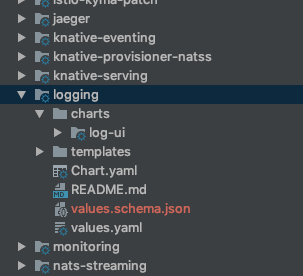

This guide covers the best practices for creating Helm charts every Kyma team should employ.

## Do not use the crd-install hook

Helm doesn't trigger the `crd-install` hook in the upgrade process. Because of that, new Custom Resource Definitions (CRDs) aren't installed. See the alternatives to using the `crd-install` hook:

1. Make the CRD part of a separate chart which must be installed before the chart that requires the CRD.

  - Implementation effort: **low**
  - Pros:
    - No additional implementation effort required.
    - The CRD is a separate file which can be used on its own, for example for tests.
  
  - Cons:
    - Requires creating more charts.
    - The CRD is managed by Helm and comes with all of the associated limitations.

2. Register the CRD through its controller.

  - Implementation effort: **medium**
  - Pros:
    - The CRD is managed by a component that is logically responsible for it.
      - The CRD is not subject to the Helm limitations.

  - Cons:
    - Requires a controller for the CRD.
    - The CRD is not listed as a part of Helm release.
    - The CRD is not available as a file.

3. Create a job that registers the new CRD and removes its old version. The job must be triggered on `pre-install` and `pre-upgrade` Helm hooks.

  - Implementation effort: **high**
  - Pros:
    - The CRD can be a separate entity.
    - Migration can be easily implemented in the job.
    - The CRD is not subject to the Helm limitations.

  - Cons:
    - Jobs are troublesome to debug.
    - The CRD is not listed as a part of Helm release.

## Moving resources between charts

Moving resources, such as ConfigMaps, Deployments, CRDs, and others from one chart to another is problematic as it causes Kyma to lose backward compatibility. The deployment in which the CRD is moved cannot be upgraded to a newer version.  

The `ABC` CRD is part of the `YYYY` chart in the 0.6 release. That CRD is moved to the `ZZZZ` chart in the 0.7 release. Kyma cannot apply changes to the `ZZZZ` chart because its CRD, `ABC`, exists in the 0.6 version as a part of the `YYYY` chart.  

To avoid these problems, rename your resources when you move them from one chart to another.

>**NOTE:** Using this approach removes the old resource and creates a new one.

When a CRD is deleted, all of the associated implementations are removed, which may cause the user to lose data. Because of this risk, migrate the CRDs instead of simply moving them between charts. Follow this procedure:

1. Backup all existing implementations.
2. Remove the old CRD.
3. Run the upgrade.
4. Restore all CRD implementations.

## Defining metadata schema for Kyma charts

This section covers the minimal requirements and conventions of metadata schema definition for Kyma charts.

The schema defines configuration parameters important from a customer perspective, as opposed to all parameters you can find in the `values.yaml` files. These parameters can vary depending on installation.
When defining a schema for a Kyma chart, follow these guidelines:

- Make sure to place the `values.schema.json` metadata file where the chart's `values.yaml` file resides. See the screenshot for reference.

   

- For each schema, define a description including detailed information about schema and Helm chart.

- Schema definition does not support dot `(.)` notation. This means that if you have nested value properties, your schema definition must define the object structure.
See the **.Values.loki.port** property for a sample object structure defined within a schema.

- For each schema object, define a **description**  to explain its purpose.

- For each configuration property, declare:
  - A **description** property to explain the configuration purpose.
  - A **default** property and its value.
  - A data **type**.
  - An **examples** property to list of possible example values, such as supported storage types. This property is optional.

An example chart `values.yaml` file looks as follows:

```yaml
loki:
  port: 3100
  nameOverride: loki
  
  config:
    auth_enabled: false
    store: inmemory

promtail:
  port: 3101
  nameOverride: promtail
```

An example `values.schema.json` file looks as follows:

```json
{
  "$schema": "http://json-schema.org/draft-07/schema#",
  "description": "Schema definition for logging helm chart values",
  "type": "object",
  "properties": {
    "loki": {
      "description": "Configuration properties for component loki",
      "type": "object",
      "properties": {
        "port": {
          "description": "TCP port loki expose",
          "default": 3100,
          "type": "number"
        },
        "nameOverride": {
          "description": "Property to override service name of loki",
          "default": "loki",
          "type": "string"
        },
        "config": {
          "type": "object",
          "description": "Loki service configuration",
          "contentEncoding": "base64",
          "properties": {
            "auth_enabled": {
              "description": "Setting to enable or disable loki basic http authentication",
              "default": false,
              "type": "boolean"
            },
            "store": {
              "description": "Storage type of log chunks",
              "type": "string",
              "default": "inmemory",
              "examples": ["consul", "inmemory"]
            }
          }
        }
      }
    },
    "promtail": {
      "description": "Configuration properties for component promtail",
      "type": "object",
      "properties": {
        "port": {
          "description": "TCP port promtail expose",
          "default": 3101,
          "type": "number"
        },
        "nameOverride": {
          "description": "Property to override service name of promtail",
          "default": "promtail",
          "type": "string"
        }
      }
    }
  }
}
```
