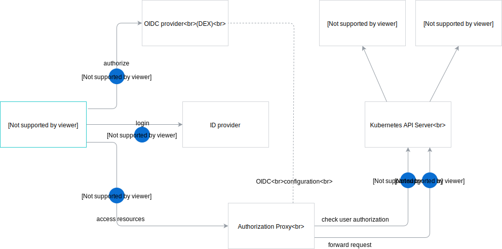

The following diagram illustrates the authorization and authentication flow in Kyma. The representation assumes the Kyma Console UI as the user's point of entry.



1. The user opens the Kyma Console UI. If the Console application doesn't find a JWT token in the browser session storage, it redirects the user's browser to the Open ID Connect (OIDC) provider, Dex.
2. Dex lists all defined Identity Provider connectors to the user. The user selects the Identity Provider to authenticate with. After successful authentication, the browser is redirected back to the OIDC provider which issues a JWT token to the user. After obtaining the token, the browser is redirected back to the Console UI. The Console UI stores the token in the Session Storage and uses it for all subsequent requests.
3. The Authorization Proxy validates the JWT token passed in the **Authorization Bearer** request header. It extracts the user and groups details, the requested resource path, and the request method from the token. The Proxy uses this data to build an attributes record, which it sends to the Kubernetes Authorization API.
4. The Proxy sends the attributes record to the Kubernetes Authorization API. If the authorization fails, the flow ends with a `403` code response.
5. If the authorization succeeds, the request is forwarded to the Kubernetes API Server.  

>**NOTE:** The Authorization Proxy can verify JWT tokens issued by Dex because Dex is registered as a trusted issuer through OIDC parameters during the Kyma installation.  

1. lololol
2. lololo
    <div tabs>
      <details>
      <summary>
      From release
      </summary>

      When you install Kyma locally from a release, follow [this](#installation-install-kyma-locally-from-the-release-install-kyma-on-minikube) guide. 
      Ensure that you created the local Kubernetes cluster with `10240Mb` memory and `30Gb` disk size.
      ```
      ./scripts/minikube.sh --domain "kyma.local" --vm-driver "hyperkit" --memory 10240Mb --disk-size 30g
      ```

      Run the following command before triggering the Kyma installation process:
      ```
      kubectl -n kyma-installer patch configmap installation-config-overrides -p '{"data": {"global.knative": "true", "global.kymaEventBus": "false", "global.natsStreaming.clusterID": "knative-nats-streaming"}}'
      ```
      </details>
      <details>
      <summary>
      From sources
      </summary>

      When you install Kyma locally from sources, add the `--knative` argument to the `run.sh` script. Run this command:

      ```
      ./run.sh --knative
      ```
      </details>
      <details>
      <summary>
      Cluster deployment
      </summary>

      Run the following command before triggering the Kyma installation process:
      ```
      kubectl -n kyma-installer patch configmap installation-config-overrides -p '{"data": {"global.knative": "true", "global.kymaEventBus": "false", "global.natsStreaming.clusterID": "knative-nats-streaming"}}'
      ```
      </details>
    </div>
3. lololo
    <div tabs>
      <details>
      <summary>
      From release
      </summary>

      When you install Kyma locally from a release, follow [this](#installation-install-kyma-locally-from-the-release-install-kyma-on-minikube) guide. 
      Ensure that you created the local Kubernetes cluster with `10240Mb` memory and `30Gb` disk size.
      ```
      ./scripts/minikube.sh --domain "kyma.local" --vm-driver "hyperkit" --memory 10240Mb --disk-size 30g
      ```

      Run the following command before triggering the Kyma installation process:
      ```
      kubectl -n kyma-installer patch configmap installation-config-overrides -p '{"data": {"global.knative": "true", "global.kymaEventBus": "false", "global.natsStreaming.clusterID": "knative-nats-streaming"}}'
      ```
      </details>
      <details>
      <summary>
      From sources
      </summary>

      When you install Kyma locally from sources, add the `--knative` argument to the `run.sh` script. Run this command:

      ```
      ./run.sh --knative
      ```
      </details>
      <details>
      <summary>
      Cluster deployment
      </summary>

      Run the following command before triggering the Kyma installation process:
      ```
      kubectl -n kyma-installer patch configmap installation-config-overrides -p '{"data": {"global.knative": "true", "global.kymaEventBus": "false", "global.natsStreaming.clusterID": "knative-nats-streaming"}}'
      ```
      </details>
    </div>