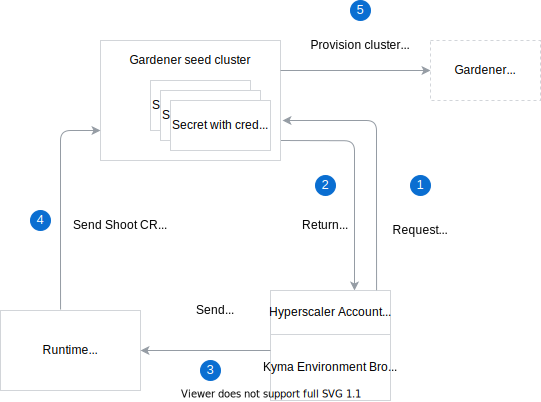

To provision clusters through Gardener using the Runtime Provisioner, the Kyma Environment Broker (KEB) requires a hyperscaler (GCP, Azure, AWS, etc.) account/subscription. Managing the available hyperscaler accounts is not in the scope of the KEB. Instead, the available accounts are handled by the Hyperscaler Account Pool (HAP). 

The HAP stores credentials for the hyperscaler accounts that have been set up in advance in Kubernetes Secrets. The credentials are stored separately for each provider and tenant. The content of the credentials Secrets may vary for different use cases. The Secrets are labeled with the **hyperscaler-type** and **tenant-name** labels to manage pools of credentials for use by the provisioning process. This way, the in-use credentials and unassigned credentials available for use are tracked. Only the **hyperscaler-type** label is added during Secret creation, and the **tenant-name** label is added when the account respective for a given Secret is claimed. The content of the Secrets is opaque to the HAP.

The Secrets are stored in a Gardener seed cluster pointed to by the HAP. They are available within a given Gardener project specified in the KEB and Runtime Provisioner configuration. This configuration uses a `kubeconfig` that gives the KEB and the Runtime Provisioner access to a specific Gardener seed cluster, which, in turn, enables access to those Secrets.

This diagram shows the HAP workflow:

 

Before a new cluster is provisioned, the KEB queries for a Secret based on the **tenant-name** and **hyperscaler-type** labels. 
If a Secret is found, the KEB uses the credentials stored in this Secret. If a matching Secret is not found, the KEB queries again for an unassigned Secret for a given hyperscaler and adds the **tenant-name** label to claim the account and use the credentials for provisioning. 

One tenant can use only one account per given hyperscaler type.

This is an example of a Kubernetes Secret that stores hyperscaler credentials:

```yaml
apiVersion: v1
kind: Secret
metadata:
  name: {SECRET_NAME}
  labels:
    # tenant-name is omitted for new, not yet claimed account credentials
    tenant-name: {TENANT_NAME}
    hyperscaler-type: {HYPERSCALER_TYPE}
```

## Shared credentials

For a certain type of Runtimes, KEB can use the same credentials for multiple tenants.
In such a case, the Secret with credentials must be labeled differently by adding the **shared** label set to `true`. Shared credentials will not be assigned to any tenant.

This is an example of a Kubernetes Secret that stores shared credentials:

```yaml
apiVersion: v1
kind: Secret
metadata:
  name: {SECRET_NAME}
  labels:
    hyperscaler-type: {HYPERSCALER_TYPE}
    shared: "true"
```
