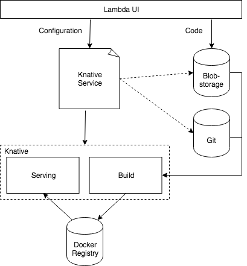

Knative is a important new project in the cloud native world. As it is back by some of the biggest player in this domain and covers major parts of an Serverless Arichtecture we are planning to replace kubeless with it.

In general kubeless and knative are sharing the same patterns. Kubeless takes some code, builds an image out of it and starts it on kubernetes. Knative is doing the same. Nevertheless, they are different and to provide the same commodity as our users are used to with kubeless, we have to do some extra work to replace it with knative.

## Architecture

So far the architecture is not shaped out fully. Many details have to be sorted out and defined. The Idea is to use knative as it is and try to bridge the existing gaps using custom components, available 3rd Party Tools (e.g. Riff) or pushing enhancements to the knative community. In the end knative should provide the same functionality as kubeless is doing today.

The core of the of the architecture are the knative serving and build components. As a kyma related component a custom build template is required providing the function interface available in kubeless.

Beside the build template a custom docker registry is required to store the build artifacts and a storage solution to store the function code. This could be a git repository or a blob storage like minio or S3. At the end the customer should be able to decide, if he likes to keep the function code in his own git repo or if he likes to store it in a storage solution provided by kyma.

## Implementation

As the implementation involves multiple components and will have breaking changes, we will keep kubeless till we are sure, the new version is working like expected. In the first step, knative-serving and -build components will be integrated as optional modules of kyma. If this is working, the other parts like docker registry, blob storage, build template etc. are enabled step by step. As a last step a new (forked) lambda UI will be created and adjusted to the needs of knative. As soon as everything is working fine, kubeless is faded out. That said, knative will be the new default and kubeless can be enabled as long as there are still old deployments available. As soon as we are sure, nobody is using the old kubeless based implementation it will be removed completely.