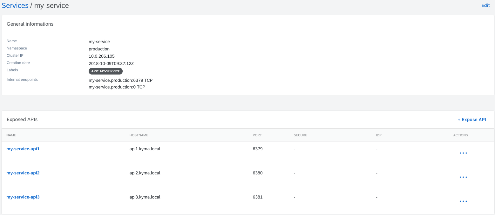
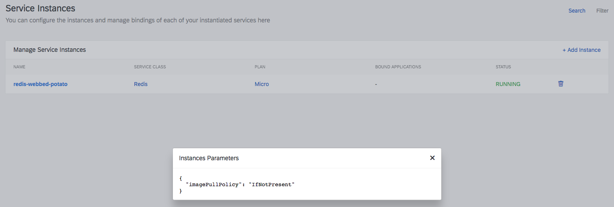
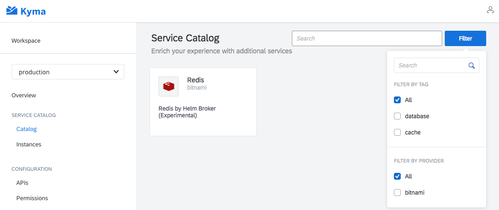
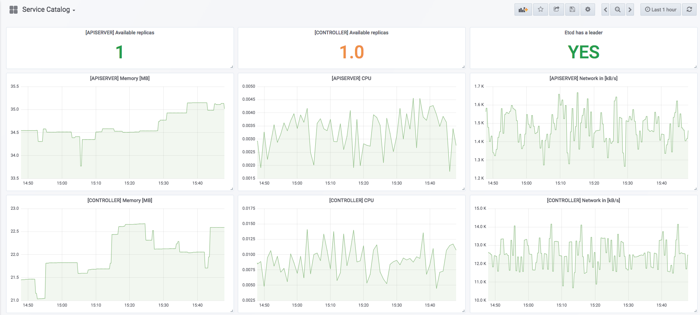
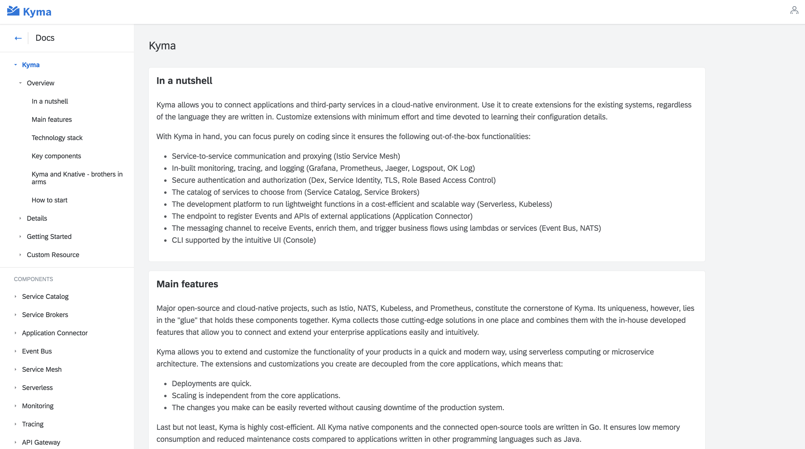

It's been a while since we introduced Kyma to open source community. Many things changed in the project since it's [announcement in July](/blog/introducing-project-kyma).
Now we have our first official release and it is time to sum up what we worked on:

## Security 

In the area of the security we focused on our [API Gateway](/docs/latest/components/api-gateway) that you can use to expose easily your API in a secured way. The following things got improved:
* Now when you create `Api` kind, `hostname` is validated to make sure you provided correct domain and that there are no duplicates.
* The [architecture](/docs/latest/components/api-gateway#architecture-architecture) of the component changed and not Istio Ingress is used to expose a Service but the Istio Gateway and the Istion Virtual Service.
* In Console UI you can now create several APIs for a single Service. You can create API for a specific Service in the Service view, or several different APIs from an API view

## Service Catalog

The Service Catalog that is one of out key features got a lot of improvements over last months, mainly thanks to your valuable feedback. To be more specific, Console UI part of the Catalog was improved:
- Multistep service provisioning wizard is now replaced with one step wizard
- In list of ServiceInstances and the ServiceInstance details now you can preview the instance parameters by clicking the instance Plan name

- Individual left navigation is removed and filtering moved next to the search. Now the filtering is enabled to support more different filters in the future and the scales much better in case there are many values provided in the filters.

Console UI is not everything though. The following things are done as well:
- Catalog is upgraded to v0.1.34 with namespace-scope resources (ServiceBroker, ServiceClass, ServicePlan) support. Related Console views do not support it yet.
- In Grafana you can find a dedicated Service Catalog dashboard that improves operations

## Application Connector

The Application Connector, that alows you to connect external systems into Kyma went through major improvements:
- Management of the Remote Environments (RE) is no longer done through the Helm chart. Now we have a controller that reacts on changes in RE and setups the whole environment,
- The [RemoteEnvironments CRD](/docs/latest/components/application-connector#custom-resource-remoteenvironment) is now enhanced with extra label field. Now you can now in a flexible way mark what is the purpose of the Remote Environment,
- The Application Connector has been powered by OAuth token caching functionality.

## Logging 

Kyma has not a new component to enhance its logging capabilities. It uses [Logspout and OK Log](/docs/latest/components/logging).

## Monitoring

Through proper Graphana configuration now all the dashboards created by you in runtime are persisted and Pods restarts do not remove them.

## Event Bus

Our Kyma would not be great without support for asynchronous communication between services. This is what we improved:
- Enabled an event lifecycle for storing events in a cluster that by default is set to 24h. You may configure the lifecycle in NATS streaming StatefulSet if you want by changing this value `max_age`.
- Added documentation for service programming model for event subscribers. Read more [here](/docs/latest/components/event-bus#details-service-programming-model)

## Tracing

As you know, to enable backend for tracing Kyma uses Jeager. To improve its usage and make it clear for you how to use it in best way we:
- Secured the Jeager UI and you can access it easily without `port-forward`. Read more about [Jeager](/docs/latest/components/tracing#overview-overview)
- Created an example on how to enable tracing for an application. Read more [here](https://github.com/kyma-project/examples/tree/master/example-tracing)

## Service Mesh

Kyma uses Istio [1.0.1](https://istio.io/about/notes/1.0.1/) now.

## Installation

The following improvements vere done in installation area:
- [Installation on Google Kupernetes Engine](https://github.com/kyma-project/kyma/blob/master/docs/kyma/docs/032-gs-gke-installation.md) is possible mainly due to Apiserver Proxy implementation (https://github.com/kyma-project/kyma/blob/master/components/apiserver-proxy/README.md)
- Possibility to override values in charts using config maps annotated with label `installer: overrides` (https://github.com/kyma-project/kyma/blob/master/docs/kyma/docs/037-gs-installation-overrides.md)
- Extended [Installation custom resource](/docs/latest/root/kyma#custom-resource-installation) with possibility to provide a declarative list of modules that will be installed during Kyma provisioning

## Documentation 

Few weeks after Kyma announcement we made sure our documentation is available on our official site https://kyma-project.io/docs/. Remember thought that this is not the only place where you can read the docs. Since the very beginning we made documentation part of the Console UI so whenever you provision Kyma cluster, docs for given Kyma version are always there for you. Last few months we improved:
- [Kyma overview](/docs/latest/root/kyma#overview-overview) documentation and many other sections, like consistency of [Custom Resource reference](/docs/latest/components/service-catalog#custom-resource-custom-resource) documentation.
- The feel and look of the documentation, improved navigation, worked on consistency and readibility of the content.

